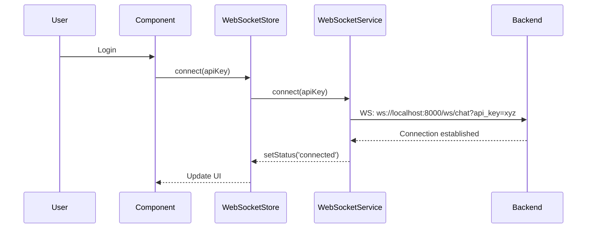
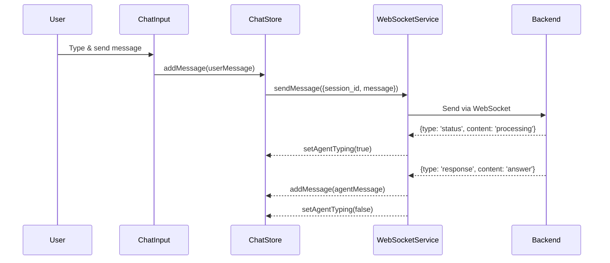
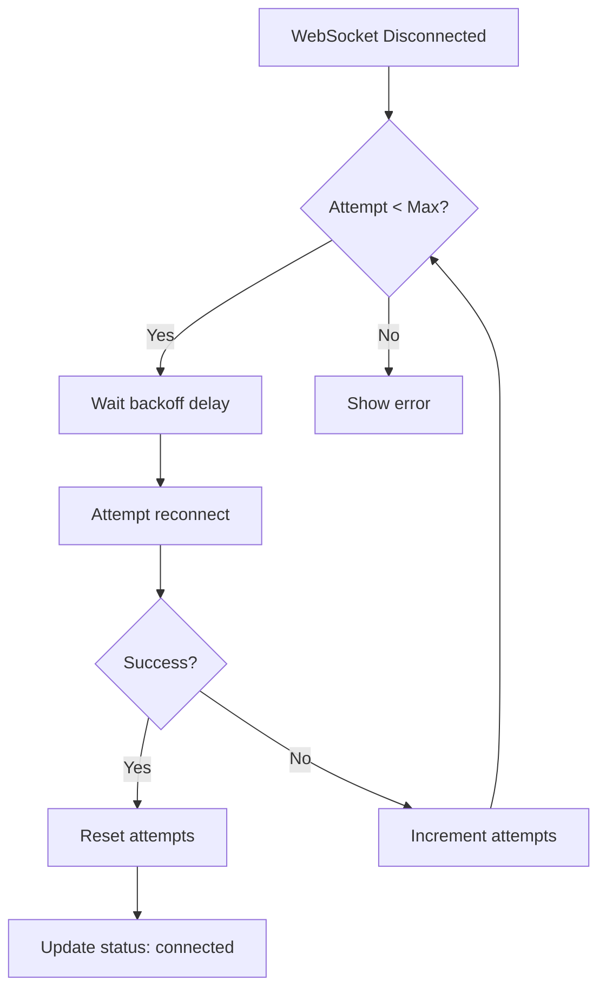
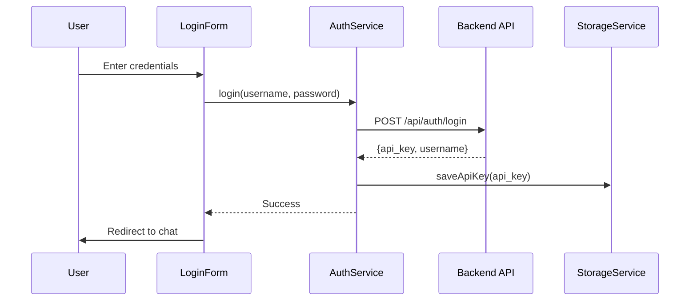
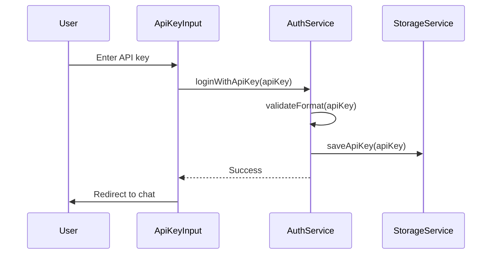
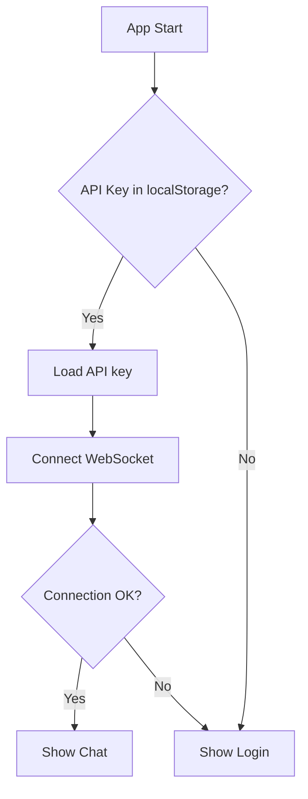
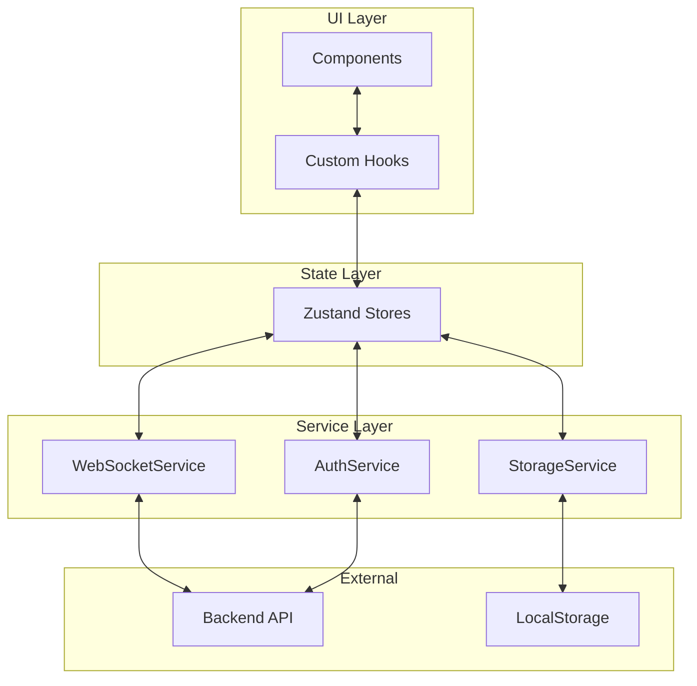

# Architektura MCP Agent Chat UI

## Přehled projektu

React aplikace pro chatovací rozhraní s MCP Agentem využívající WebSocket komunikaci pro real-time interakci.

### Technologie
- **Frontend Framework**: React 19 + TypeScript
- **Build Tool**: Vite
- **State Management**: Zustand
- **Styling**: Tailwind CSS
- **WebSocket**: Native WebSocket API
- **Persistence**: LocalStorage API

---

## 1. Struktura složek a souborů

```
src/
├── components/              # React komponenty
│   ├── auth/               # Autentizační komponenty
│   │   ├── LoginForm.tsx
│   │   ├── ApiKeyInput.tsx
│   │   └── ProtectedRoute.tsx
│   │
│   ├── chat/               # Chatovací komponenty
│   │   ├── ChatContainer.tsx
│   │   ├── ChatHeader.tsx
│   │   ├── MessageList.tsx
│   │   ├── Message.tsx
│   │   ├── ChatInput.tsx
│   │   └── TypingIndicator.tsx
│   │
│   ├── session/            # Správa sessions
│   │   ├── SessionList.tsx
│   │   ├── SessionItem.tsx
│   │   └── NewSessionButton.tsx
│   │
│   ├── common/             # Sdílené komponenty
│   │   ├── ConnectionStatus.tsx
│   │   ├── ErrorBoundary.tsx
│   │   ├── LoadingSpinner.tsx
│   │   └── Toast.tsx
│   │
│   └── layout/             # Layout komponenty
│       ├── AppLayout.tsx
│       ├── Sidebar.tsx
│       └── Header.tsx
│
├── services/               # Business logika a API
│   ├── websocket.service.ts
│   ├── auth.service.ts
│   └── storage.service.ts
│
├── stores/                 # Zustand stores
│   ├── authStore.ts
│   ├── chatStore.ts
│   ├── sessionStore.ts
│   └── websocketStore.ts
│
├── hooks/                  # Custom React hooks
│   ├── useWebSocket.ts
│   ├── useAuth.ts
│   ├── useChat.ts
│   └── useSession.ts
│
├── types/                  # TypeScript definice
│   ├── auth.types.ts
│   ├── chat.types.ts
│   ├── session.types.ts
│   └── websocket.types.ts
│
├── utils/                  # Pomocné funkce
│   ├── constants.ts
│   ├── validators.ts
│   └── formatters.ts
│
├── config/                 # Konfigurace
│   └── api.config.ts
│
├── App.tsx                 # Hlavní aplikační komponenta
├── main.tsx               # Entry point
└── index.css              # Globální styly + Tailwind
```

---

## 2. Datové modely (TypeScript Interfaces)

### 2.1 Autentizace (`types/auth.types.ts`)

```typescript
/**
 * Stav autentizace uživatele
 */
export interface AuthState {
  isAuthenticated: boolean;
  apiKey: string | null;
  username: string | null;
  error: string | null;
}

/**
 * Přihlašovací údaje
 */
export interface LoginCredentials {
  username: string;
  password: string;
}

/**
 * Odpověď z login endpointu
 */
export interface LoginResponse {
  api_key: string;
  username: string;
  expires_at?: string;
}
```

### 2.2 Chat zprávy (`types/chat.types.ts`)

```typescript
/**
 * Typ zprávy
 */
export type MessageRole = 'user' | 'agent' | 'system';

/**
 * Status zprávy
 */
export type MessageStatus = 'sending' | 'sent' | 'error';

/**
 * Chatová zpráva
 */
export interface ChatMessage {
  id: string;
  sessionId: string;
  role: MessageRole;
  content: string;
  timestamp: number;
  status?: MessageStatus;
  error?: string;
}

/**
 * Stav chatu
 */
export interface ChatState {
  messages: ChatMessage[];
  isAgentTyping: boolean;
  error: string | null;
}
```

### 2.3 Sessions (`types/session.types.ts`)

```typescript
/**
 * Chatová session
 */
export interface ChatSession {
  id: string;
  title: string;
  createdAt: number;
  lastMessageAt: number;
  messageCount: number;
}

/**
 * Stav sessions
 */
export interface SessionState {
  sessions: ChatSession[];
  activeSessionId: string | null;
  isLoading: boolean;
}
```

### 2.4 WebSocket (`types/websocket.types.ts`)

```typescript
/**
 * Stav WebSocket připojení
 */
export type ConnectionStatus = 'disconnected' | 'connecting' | 'connected' | 'error';

/**
 * WebSocket zpráva od serveru
 */
export interface WSMessage {
  type: 'status' | 'response' | 'error';
  content?: string;
  error?: string;
  timestamp?: number;
}

/**
 * WebSocket zpráva pro odeslání
 */
export interface WSOutgoingMessage {
  session_id: string;
  message: string;
  timestamp: number;
}

/**
 * WebSocket stav
 */
export interface WebSocketState {
  status: ConnectionStatus;
  error: string | null;
  reconnectAttempts: number;
}
```

---

## 3. State Management (Zustand)

### 3.1 Auth Store (`stores/authStore.ts`)

**Zodpovědnosti:**
- Správa autentizačního stavu
- Persistence API klíče
- Login/logout operace

**Struktura:**
```typescript
interface AuthStore {
  // State
  isAuthenticated: boolean;
  apiKey: string | null;
  username: string | null;
  error: string | null;
  
  // Actions
  login: (credentials: LoginCredentials) => Promise<void>;
  loginWithApiKey: (apiKey: string) => void;
  logout: () => void;
  restoreSession: () => void;
  clearError: () => void;
}
```

### 3.2 WebSocket Store (`stores/websocketStore.ts`)

**Zodpovědnosti:**
- Správa WebSocket připojení
- Auto-reconnect logika
- Stav připojení

**Struktura:**
```typescript
interface WebSocketStore {
  // State
  status: ConnectionStatus;
  error: string | null;
  reconnectAttempts: number;
  
  // Actions
  connect: (apiKey: string) => void;
  disconnect: () => void;
  sendMessage: (message: WSOutgoingMessage) => void;
  setStatus: (status: ConnectionStatus) => void;
  resetReconnectAttempts: () => void;
}
```

### 3.3 Chat Store (`stores/chatStore.ts`)

**Zodpovědnosti:**
- Správa zpráv aktuální session
- Přidávání a aktualizace zpráv
- Stav "agent píše"

**Struktura:**
```typescript
interface ChatStore {
  // State
  messages: ChatMessage[];
  isAgentTyping: boolean;
  error: string | null;
  
  // Actions
  addMessage: (message: Omit<ChatMessage, 'id' | 'timestamp'>) => void;
  updateMessageStatus: (id: string, status: MessageStatus) => void;
  setAgentTyping: (isTyping: boolean) => void;
  clearMessages: () => void;
  loadMessagesForSession: (sessionId: string) => void;
}
```

### 3.4 Session Store (`stores/sessionStore.ts`)

**Zodpovědnosti:**
- Správa seznamu sessions
- Aktivní session
- CRUD operace pro sessions

**Struktura:**
```typescript
interface SessionStore {
  // State
  sessions: ChatSession[];
  activeSessionId: string | null;
  isLoading: boolean;
  
  // Actions
  createSession: () => string;
  setActiveSession: (sessionId: string) => void;
  deleteSession: (sessionId: string) => void;
  updateSessionTitle: (sessionId: string, title: string) => void;
  loadSessions: () => void;
}
```

---

## 4. Service vrstva

### 4.1 WebSocket Service (`services/websocket.service.ts`)

**Zodpovědnosti:**
- Vytváření a správa WebSocket připojení
- Zpracování příchozích zpráv
- Auto-reconnect mechanismus
- Error handling

**Klíčové funkce:**
```typescript
class WebSocketService {
  private ws: WebSocket | null;
  private reconnectInterval: number;
  private maxReconnectAttempts: number;
  
  connect(apiKey: string): void;
  disconnect(): void;
  sendMessage(message: WSOutgoingMessage): void;
  onMessage(callback: (message: WSMessage) => void): void;
  onStatusChange(callback: (status: ConnectionStatus) => void): void;
  private attemptReconnect(): void;
  private handleError(error: Event): void;
}
```

**Vlastnosti:**
- Singleton pattern pro jednu instanci
- Event-based komunikace s komponenty
- Exponenciální backoff pro reconnect
- Heartbeat/ping mechanismus

### 4.2 Auth Service (`services/auth.service.ts`)

**Zodpovědnosti:**
- HTTP komunikace s auth endpointem
- Validace API klíče
- Token management

**Klíčové funkce:**
```typescript
class AuthService {
  async login(credentials: LoginCredentials): Promise<LoginResponse>;
  async validateApiKey(apiKey: string): Promise<boolean>;
  async logout(): Promise<void>;
  getStoredApiKey(): string | null;
  setStoredApiKey(apiKey: string): void;
  clearStoredApiKey(): void;
}
```

### 4.3 Storage Service (`services/storage.service.ts`)

**Zodpovědnosti:**
- Persistence dat do localStorage
- Serializace/deserializace
- Error handling pro storage operace

**Klíčové funkce:**
```typescript
class StorageService {
  // Auth
  saveApiKey(apiKey: string): void;
  getApiKey(): string | null;
  clearApiKey(): void;
  
  // Sessions
  saveSessions(sessions: ChatSession[]): void;
  getSessions(): ChatSession[];
  
  // Messages
  saveMessages(sessionId: string, messages: ChatMessage[]): void;
  getMessages(sessionId: string): ChatMessage[];
  clearMessages(sessionId: string): void;
  
  // Helpers
  private setItem<T>(key: string, value: T): void;
  private getItem<T>(key: string): T | null;
  private removeItem(key: string): void;
}
```

---

## 5. Hlavní komponenty

### 5.1 Layout komponenty

#### `AppLayout.tsx`
- **Zodpovědnost**: Hlavní layout aplikace
- **Struktura**: Sidebar + Main content area
- **Props**: None (používá stores)

#### `Sidebar.tsx`
- **Zodpovědnost**: Levý panel s sessions a navigací
- **Obsah**: SessionList, NewSessionButton, user info
- **Props**: None

#### `Header.tsx`
- **Zodpovědnost**: Horní lišta s názvem session a actions
- **Obsah**: Session title, ConnectionStatus, logout button
- **Props**: None

### 5.2 Auth komponenty

#### `LoginForm.tsx`
- **Zodpovědnost**: Formulář pro přihlášení username/password
- **State**: Local state pro form fields
- **Events**: onSubmit -> authStore.login()

#### `ApiKeyInput.tsx`
- **Zodpovědnost**: Přímé zadání API klíče
- **State**: Local state pro API key input
- **Events**: onSubmit -> authStore.loginWithApiKey()

#### `ProtectedRoute.tsx`
- **Zodpovědnost**: Ochrana routes před neautorizovaným přístupem
- **Logic**: Redirect na login pokud !isAuthenticated
- **Props**: children: ReactNode

### 5.3 Chat komponenty

#### `ChatContainer.tsx`
- **Zodpovědnost**: Hlavní container pro chat
- **Obsah**: ChatHeader, MessageList, ChatInput
- **Hooks**: useChat, useWebSocket
- **Props**: None

#### `MessageList.tsx`
- **Zodpovědnost**: Scrollovatelný seznam zpráv
- **Features**: Auto-scroll, virtualizace (optional)
- **Props**: messages: ChatMessage[]

#### `Message.tsx`
- **Zodpovědnost**: Jednotlivá zpráva
- **Variants**: User message, Agent message, System message
- **Props**: message: ChatMessage

#### `ChatInput.tsx`
- **Zodpovědnost**: Textové pole pro vstup
- **Features**: Multi-line, enter to send, shift+enter new line
- **Events**: onSend -> chatStore.addMessage()
- **Props**: disabled?: boolean

#### `TypingIndicator.tsx`
- **Zodpovědnost**: Animovaný indikátor "agent píše"
- **State**: isVisible: boolean from chatStore
- **Props**: None

### 5.4 Session komponenty

#### `SessionList.tsx`
- **Zodpovědnost**: Seznam všech sessions
- **Features**: Scrollable, active highlight
- **Props**: None (používá sessionStore)

#### `SessionItem.tsx`
- **Zodpovědnost**: Jednotlivá session v seznamu
- **Features**: Click to activate, delete button
- **Props**: session: ChatSession, isActive: boolean

#### `NewSessionButton.tsx`
- **Zodpovědnost**: Tlačítko pro vytvoření nové session
- **Events**: onClick -> sessionStore.createSession()
- **Props**: None

### 5.5 Common komponenty

#### `ConnectionStatus.tsx`
- **Zodpovědnost**: Indikátor stavu WS připojení
- **States**: Connected (green), Connecting (yellow), Error (red)
- **Props**: status: ConnectionStatus

#### `ErrorBoundary.tsx`
- **Zodpovědnost**: Zachycení React errors
- **Features**: Fallback UI, error reporting
- **Props**: children: ReactNode

#### `LoadingSpinner.tsx`
- **Zodpovědnost**: Loading indikátor
- **Variants**: Fullscreen, inline, button
- **Props**: size?: 'sm' | 'md' | 'lg'

#### `Toast.tsx`
- **Zodpovědnost**: Notifikace pro uživatele
- **Types**: Success, error, info, warning
- **Props**: message: string, type: ToastType

---

## 6. Custom Hooks

### `useWebSocket.ts`
**Účel**: Abstrakce WebSocket komunikace

```typescript
interface UseWebSocketReturn {
  status: ConnectionStatus;
  sendMessage: (message: string) => void;
  isConnected: boolean;
}

function useWebSocket(sessionId: string | null): UseWebSocketReturn
```

### `useAuth.ts`
**Účel**: Abstrakce autentizační logiky

```typescript
interface UseAuthReturn {
  isAuthenticated: boolean;
  login: (credentials: LoginCredentials) => Promise<void>;
  loginWithApiKey: (apiKey: string) => void;
  logout: () => void;
  error: string | null;
}

function useAuth(): UseAuthReturn
```

### `useChat.ts`
**Účel**: Správa chat logiky pro aktivní session

```typescript
interface UseChatReturn {
  messages: ChatMessage[];
  isAgentTyping: boolean;
  sendMessage: (content: string) => void;
  error: string | null;
}

function useChat(): UseChatReturn
```

### `useSession.ts`
**Účel**: Správa sessions

```typescript
interface UseSessionReturn {
  sessions: ChatSession[];
  activeSession: ChatSession | null;
  createSession: () => void;
  switchSession: (sessionId: string) => void;
  deleteSession: (sessionId: string) => void;
}

function useSession(): UseSessionReturn
```

---

## 7. WebSocket komunikační flow

### 7.1 Připojení



### 7.2 Odeslání zprávy



### 7.3 Auto-reconnect



---

## 8. Autentizační flow

### 8.1 Login s username/password



### 8.2 Login s API klíčem



### 8.3 Auto-login při návratu



---

## 9. Datový tok v aplikaci

### 9.1 Architektura datového toku



### 9.2 Komunikační vzory

**1. Component -> Store -> Service -> Backend**
- Používá se pro: Odesílání zpráv, autentizace
- Flow: User action -> Hook -> Store action -> Service -> API/WS

**2. Backend -> Service -> Store -> Component**
- Používá se pro: Příchozí zprávy, status updates
- Flow: WS message -> Service callback -> Store update -> Component re-render

**3. Store <-> LocalStorage**
- Používá se pro: Persistence dat
- Flow: Store change -> StorageService.save() / App init -> StorageService.load()

---

## 10. Error Handling strategie

### 10.1 Typy chyb

1. **Network Errors**
   - WebSocket disconnect
   - HTTP request failures
   - Řešení: Auto-reconnect, retry logika, user notification

2. **Authentication Errors**
   - Invalid credentials
   - Expired API key
   - Řešení: Clear session, redirect to login

3. **Validation Errors**
   - Invalid input
   - Missing required fields
   - Řešení: Form validation, inline errors

4. **Application Errors**
   - React rendering errors
   - Store state corruption
   - Řešení: ErrorBoundary, fallback UI

### 10.2 Error handling pattern

```typescript
// V každém store
interface StoreState {
  error: string | null;
  isLoading: boolean;
}

// Async action pattern
const someAction = async () => {
  set({ isLoading: true, error: null });
  try {
    const result = await service.doSomething();
    set({ data: result, isLoading: false });
  } catch (error) {
    set({ 
      error: error.message, 
      isLoading: false 
    });
  }
};
```

---

## 11. Performance optimalizace

### 11.1 Strategie

1. **React Optimalizace**
   - React.memo pro Message komponenty
   - useMemo pro expensive výpočty
   - useCallback pro event handlers
   - Lazy loading komponent

2. **State Management**
   - Selektivní store subscriptions
   - Shallow equality checks
   - Computed values v stores

3. **WebSocket**
   - Message batching
   - Debounce typing indicators
   - Connection pooling

4. **Rendering**
   - Virtual scrolling pro dlouhé seznamy zpráv
   - Pagination/infinite scroll
   - Code splitting per route

### 11.2 Monitoring

- Console warnings ve dev módu
- Performance marks pro kritické operace
- WebSocket message rate limiting

---

## 12. Security considerations

### 12.1 Bezpečnostní opatření

1. **API Key Management**
   - Šifrování v localStorage (optional)
   - Automatic expiration
   - Secure transmission

2. **Input Sanitization**
   - XSS prevention
   - Message content validation
   - SQL injection prevention (backend)

3. **WebSocket Security**
   - WSS pro production
   - Token validation
   - Rate limiting

4. **CORS**
   - Whitelist backend origin
   - Credentials handling

---

## 13. Testing strategie

### 13.1 Typy testů

1. **Unit Tests**
   - Services (auth, websocket, storage)
   - Utility functions
   - Stores (actions, selectors)

2. **Integration Tests**
   - Component + Hook + Store
   - WebSocket message flow
   - Auth flow

3. **E2E Tests**
   - Login -> Chat -> Logout
   - Session management
   - Error scenarios

### 13.2 Testing tools (doporučené)

- Vitest - unit testing
- React Testing Library - component testing
- Playwright - E2E testing

---

## 14. Deployment considerations

### 14.1 Build optimalizace

```json
// vite.config.ts optimalizace
{
  build: {
    rollupOptions: {
      output: {
        manualChunks: {
          'react-vendor': ['react', 'react-dom'],
          'store': ['zustand'],
        }
      }
    }
  }
}
```

### 14.2 Environment variables

```bash
# .env.example
VITE_API_BASE_URL=http://localhost:8000
VITE_WS_URL=ws://localhost:8000/ws/chat
VITE_MAX_RECONNECT_ATTEMPTS=5
VITE_RECONNECT_DELAY=1000
```

### 14.3 Production checklist

- [ ] Enable WSS (WebSocket Secure)
- [ ] Configure CORS properly
- [ ] Minify and optimize bundle
- [ ] Enable compression
- [ ] Set up error logging (Sentry)
- [ ] Configure analytics
- [ ] SSL/TLS certificates

---

## 15. Budoucí rozšíření

### Možná vylepšení:

1. **功能扩展**
   - Multi-user sessions
   - File upload support
   - Voice input/output
   - Message reactions
   - Message search

2. **UX vylepšení**
   - Dark/light theme
   - Keyboard shortcuts
   - Markdown rendering
   - Code syntax highlighting
   - Message editing/deletion

3. **Technická vylepšení**
   - PWA support
   - Offline mode
   - Service Worker pro caching
   - Real-time collaboration
   - WebRTC pro video/audio

---

## 16. Závěr

Tato architektura poskytuje:

✅ **Škálovatelnost** - Modulární struktura umožňuje snadné rozšíření  
✅ **Maintainability** - Jasná separace zodpovědností  
✅ **Type Safety** - Kompletní TypeScript coverage  
✅ **Performance** - Optimalizované rendering a state management  
✅ **Developer Experience** - Moderní tooling a best practices  
✅ **User Experience** - Real-time komunikace, responsive UI  

Architektura je připravena pro implementaci v Code módu.