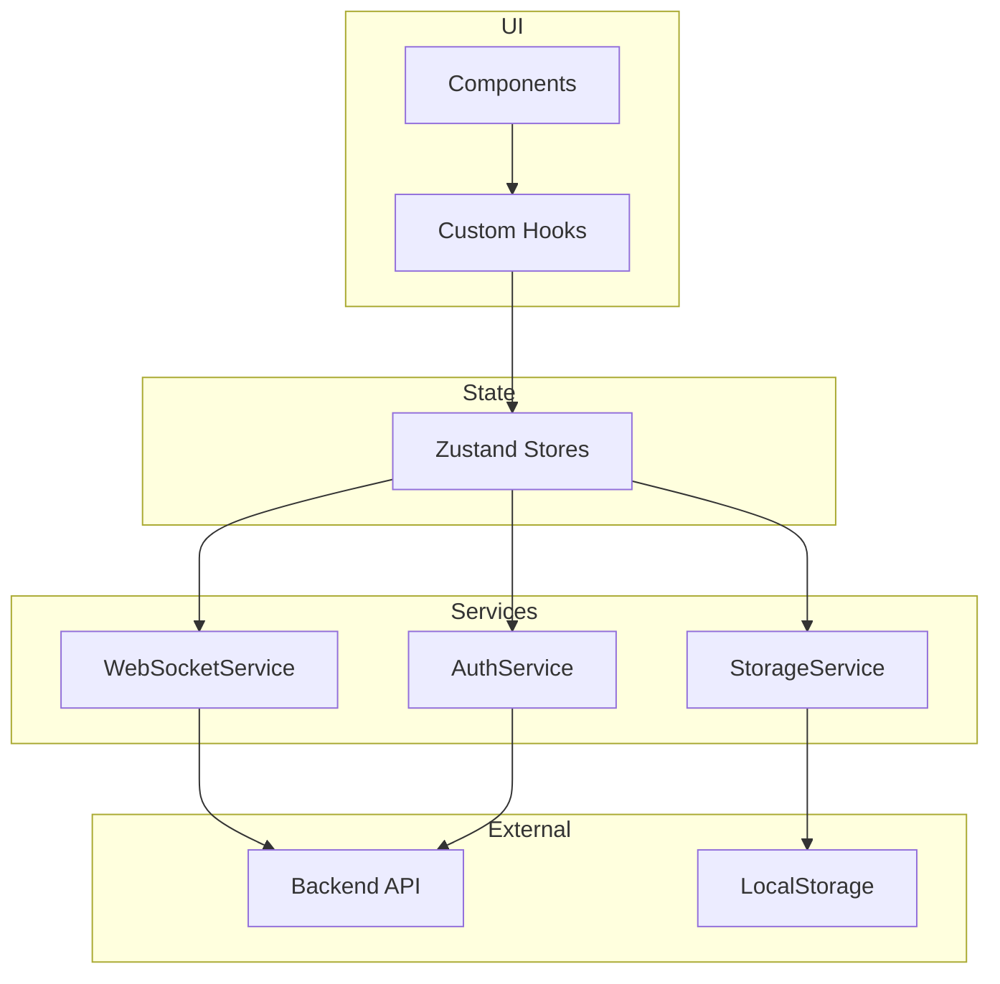

# MCP Agent Chat UI - Architektonický návrh

> **Kompletní návrh React aplikace pro chatovací rozhraní s MCP Agentem**

---

## 📋 Obsah

1. [Přehled projektu](#přehled-projektu)
2. [Rychlý start](#rychlý-start)
3. [Dokumentace](#dokumentace)
4. [Technologie](#technologie)
5. [Architektura](#architektura)
6. [Implementace](#implementace)

---

## 🎯 Přehled projektu

MCP Agent Chat UI je moderní React aplikace poskytující intuitivní rozhraní pro komunikaci s MCP Agentem přes WebSocket. Aplikace podporuje:

- ✅ **Autentizace** - Přihlášení přes username/password nebo přímý API klíč
- ✅ **Real-time komunikace** - WebSocket s auto-reconnect
- ✅ **Session management** - Správa více konverzací
- ✅ **Persistence** - Ukládání zpráv a sessions v localStorage
- ✅ **TypeScript** - Plná type safety
- ✅ **Modern UI** - Tailwind CSS pro responsivní design

---

## 🚀 Rychlý start

### 1. Instalace závislostí

```bash
# State management a utilities
npm install zustand uuid
npm install -D @types/uuid

# Styling
npm install -D tailwindcss postcss autoprefixer
npx tailwindcss init -p

# Optional: Better form styles
npm install -D @tailwindcss/forms
npm install clsx
```

### 2. Konfigurace

```bash
# Vytvořit environment variables
cp .env.example .env.development
```

### 3. Přečíst dokumentaci

1. [`ARCHITEKTURA.md`](./ARCHITEKTURA.md) - Kompletní architektonický návrh
2. [`ZAVISLOSTI.md`](./ZAVISLOSTI.md) - Detailní seznam závislostí a konfigurace
3. [`IMPLEMENTACNI_PLAN.md`](./IMPLEMENTACNI_PLAN.md) - Krok-za-krokem implementační plán
4. [`REFERENCE.md`](./REFERENCE.md) - Příklady kódu a reference

### 4. Začít implementaci

```bash
# Spustit v Code módu pro implementaci
# Následovat IMPLEMENTACNI_PLAN.md
```

---

## 📚 Dokumentace

### Hlavní dokumenty

| Dokument | Popis | Použití |
|----------|-------|---------|
| [`ARCHITEKTURA.md`](./ARCHITEKTURA.md) | Kompletní architektonický návrh, datové modely, komponenty | **Začít zde** - Celkový přehled |
| [`ZAVISLOSTI.md`](./ZAVISLOSTI.md) | Seznam závislostí, instalační příkazy, konfigurace | Setup projektu |
| [`IMPLEMENTACNI_PLAN.md`](./IMPLEMENTACNI_PLAN.md) | Detailní plán implementace po fázích | Krok-za-krokem guide |
| [`REFERENCE.md`](./REFERENCE.md) | Příklady kódu, ukázky implementace | Reference při kódování |

---

## 🛠 Technologie

### Core Stack
- **React 19** - UI framework
- **TypeScript** - Type safety
- **Vite** - Build tool
- **Zustand** - State management
- **Tailwind CSS** - Styling

### Key Features
- **WebSocket** - Real-time komunikace
- **LocalStorage** - Data persistence
- **Auto-reconnect** - Robustní síťová komunikace
- **Error Boundaries** - Graceful error handling

---

## 🏗 Architektura

### Struktura projektu

```
src/
├── components/          # React komponenty
│   ├── auth/           # Autentizace (LoginForm, ApiKeyInput)
│   ├── chat/           # Chat UI (MessageList, ChatInput)
│   ├── session/        # Sessions (SessionList, SessionItem)
│   ├── common/         # Sdílené (LoadingSpinner, Toast)
│   └── layout/         # Layout (AppLayout, Sidebar)
│
├── services/           # Business logika
│   ├── websocket.service.ts
│   ├── auth.service.ts
│   └── storage.service.ts
│
├── stores/             # Zustand stores
│   ├── authStore.ts
│   ├── chatStore.ts
│   ├── sessionStore.ts
│   └── websocketStore.ts
│
├── hooks/              # Custom hooks
│   ├── useWebSocket.ts
│   ├── useAuth.ts
│   ├── useChat.ts
│   └── useSession.ts
│
├── types/              # TypeScript types
│   ├── auth.types.ts
│   ├── chat.types.ts
│   ├── session.types.ts
│   └── websocket.types.ts
│
└── utils/              # Utilities
    ├── constants.ts
    ├── validators.ts
    └── formatters.ts
```

### Datový tok



### Klíčové komponenty

#### 1. Autentizace
- [`LoginForm.tsx`](src/components/auth/LoginForm.tsx) - Přihlašovací formulář
- [`ApiKeyInput.tsx`](src/components/auth/ApiKeyInput.tsx) - Direct API key input
- [`ProtectedRoute.tsx`](src/components/auth/ProtectedRoute.tsx) - Route guard

#### 2. Chat
- [`ChatContainer.tsx`](src/components/chat/ChatContainer.tsx) - Hlavní chat kontejner
- [`MessageList.tsx`](src/components/chat/MessageList.tsx) - Seznam zpráv
- [`Message.tsx`](src/components/chat/Message.tsx) - Jednotlivá zpráva
- [`ChatInput.tsx`](src/components/chat/ChatInput.tsx) - Input pole
- [`TypingIndicator.tsx`](src/components/chat/TypingIndicator.tsx) - "Agent píše..."

#### 3. Sessions
- [`SessionList.tsx`](src/components/session/SessionList.tsx) - Seznam sessions
- [`SessionItem.tsx`](src/components/session/SessionItem.tsx) - Session položka
- [`NewSessionButton.tsx`](src/components/session/NewSessionButton.tsx) - Nová session

#### 4. Layout
- [`AppLayout.tsx`](src/components/layout/AppLayout.tsx) - Hlavní layout
- [`Sidebar.tsx`](src/components/layout/Sidebar.tsx) - Boční panel
- [`Header.tsx`](src/components/layout/Header.tsx) - Horní lišta

---

## 💻 Implementace

### Fáze implementace

| Fáze | Komponenty | Čas | Priorita |
|------|-----------|-----|----------|
| **1. Příprava** | Instalace, konfigurace | 1-2h | 🔴 Kritická |
| **2. Struktura** | Složky, TypeScript types | 2-3h | 🔴 Kritická |
| **3. Services** | WebSocket, Auth, Storage | 4-6h | 🔴 Kritická |
| **4. State** | Zustand stores | 4-5h | 🔴 Kritická |
| **5. Hooks** | Custom hooks | 2-3h | 🟡 Vysoká |
| **6. UI Common** | Loading, Error, Toast | 3-4h | 🟡 Vysoká |
| **7. Auth UI** | Login komponenty | 4-5h | 🔴 Kritická |
| **8. Layout** | AppLayout, Sidebar | 3-4h | 🟡 Vysoká |
| **9. Sessions** | Session management | 4-5h | 🟡 Vysoká |
| **10. Chat** | Chat komponenty | 6-8h | 🔴 Kritická |
| **11. Integrace** | Propojení všeho | 4-6h | 🔴 Kritická |
| **12. Polish** | UX, optimalizace | 6-8h | 🟢 Střední |

**Celkem**: ~56-76 hodin (7-10 pracovních dnů)

### MVP (Minimum Viable Product)

Pro rychlý start - implementovat v tomto pořadí:

1. ✅ Services (Storage, Auth, WebSocket)
2. ✅ Stores (Auth, WebSocket, Chat)
3. ✅ Auth komponenty
4. ✅ Chat komponenty
5. ✅ Základní integrace

**Výsledek**: Funkční chat s autentizací (~30-40 hodin)

---

## 🎨 Design Patterns

### 1. Service Layer Pattern
- Abstrakce API komunikace
- Centralizovaná business logika
- Testovatelné služby

### 2. Custom Hooks Pattern
- Reusable logika
- Separation of concerns
- Clean komponenty

### 3. Store Pattern (Zustand)
- Centralizovaný state
- Immutable updates
- Predictable state changes

### 4. Compound Components
- Flexibilní komponenty
- Composition over inheritance
- Clear API

---

## 🔒 Security

### Implementovaná opatření

- ✅ API key uložení v localStorage
- ✅ Input sanitization
- ✅ WebSocket authentication
- ✅ Error boundaries
- ✅ Type safety (TypeScript)

### Production checklist

- [ ] WSS (WebSocket Secure)
- [ ] HTTPS
- [ ] CORS konfigurace
- [ ] Rate limiting
- [ ] Error logging (Sentry)
- [ ] API key encryption (optional)

---

## 📊 Performance

### Optimalizace

1. **React optimalizace**
   - React.memo pro Message komponenty
   - useMemo pro expensive výpočty
   - useCallback pro event handlers

2. **Bundle optimalizace**
   - Code splitting
   - Lazy loading
   - Tree shaking

3. **Network optimalizace**
   - WebSocket message batching
   - Debounce typing indicators
   - Auto-reconnect s exponential backoff

### Očekávaná velikost

- **Production bundle**: ~170-230 KB (gzipped)
- **React + React-DOM**: ~130 KB
- **Zustand**: ~3 KB
- **App Code**: ~20-40 KB
- **Tailwind CSS**: ~10-50 KB (závisí na použití)

---

## 🧪 Testing

### Testing strategie

```typescript
// Unit tests
- Services (auth, websocket, storage)
- Utility functions
- Store actions

// Integration tests
- Component + Hook + Store
- WebSocket message flow
- Auth flow

// E2E tests
- Login -> Chat -> Logout
- Session management
- Error scenarios
```

### Testing tools

- **Vitest** - Unit testing
- **React Testing Library** - Component testing
- **Playwright** - E2E testing

---

## 📦 Deployment

### Environment Variables

```bash
# Development
VITE_API_BASE_URL=http://localhost:8000
VITE_WS_URL=ws://localhost:8000/ws/chat
VITE_MAX_RECONNECT_ATTEMPTS=5
VITE_RECONNECT_DELAY=1000

# Production
VITE_API_BASE_URL=https://api.yourdomain.com
VITE_WS_URL=wss://api.yourdomain.com/ws/chat
VITE_MAX_RECONNECT_ATTEMPTS=3
VITE_RECONNECT_DELAY=2000
```

### Build

```bash
# Type check
npm run type-check

# Build
npm run build

# Preview production build
npm run preview
```

---

## 🔄 Workflow

### Doporučený workflow

1. **Přečíst architekturu** → [`ARCHITEKTURA.md`](./ARCHITEKTURA.md)
2. **Nainstalovat závislosti** → [`ZAVISLOSTI.md`](./ZAVISLOSTI.md)
3. **Následovat plán** → [`IMPLEMENTACNI_PLAN.md`](./IMPLEMENTACNI_PLAN.md)
4. **Používat reference** → [`REFERENCE.md`](./REFERENCE.md)
5. **Testovat průběžně**
6. **Commit často**
7. **Deploy**

### Git workflow

```bash
# Feature development
git checkout -b feature/auth-system
# ... implement
git commit -m "feat: implement auth system"
git push origin feature/auth-system

# Code review
# Merge to main
```

---

## 🚧 Budoucí rozšíření

### Plánovaná vylepšení

- 📱 **PWA support** - Offline mode, installable app
- 🌙 **Dark mode** - Theme switching
- 📁 **File upload** - Share files in chat
- 🎤 **Voice input** - Speech-to-text
- 🔍 **Message search** - Full-text search
- ⚡ **Real-time collaboration** - Multi-user sessions
- 🎨 **Theming system** - Customizable colors
- 📊 **Analytics** - Usage tracking

---

## 🤝 Contributing

### Code Style

- TypeScript strict mode
- ESLint + Prettier
- Conventional commits
- Component-first approach

### Pull Request Process

1. Fork repository
2. Create feature branch
3. Make changes
4. Write tests
5. Update documentation
6. Submit PR

---

## 📝 License

MIT License - see LICENSE file for details

---

## 🆘 Support

### Troubleshooting

**WebSocket nepřipojuje?**
- Zkontrolovat backend běží
- Ověřit API klíč
- Zkontrolovat CORS

**Tailwind nefunguje?**
- Zkontrolovat tailwind.config.js
- Restartovat dev server
- Ověřit import v index.css

**TypeScript errors?**
- Zkontrolovat tsconfig.json
- Restartovat TS server
- npm run type-check

### Kontakt

- **Issues**: GitHub Issues
- **Email**: support@example.com
- **Docs**: Full documentation in linked files

---

## ✅ Kontrolní seznam

### Před začátkem implementace

- [ ] Přečtena [`ARCHITEKTURA.md`](./ARCHITEKTURA.md)
- [ ] Přečtena [`ZAVISLOSTI.md`](./ZAVISLOSTI.md)
- [ ] Přečten [`IMPLEMENTACNI_PLAN.md`](./IMPLEMENTACNI_PLAN.md)
- [ ] Nainstalovány závislosti
- [ ] Nakonfigurován Tailwind
- [ ] Vytvořeny .env soubory
- [ ] Připraven git repository

### Během implementace

- [ ] Používat TypeScript typy
- [ ] Testovat každou komponentu
- [ ] Commit často
- [ ] Dokumentovat změny
- [ ] Konzultovat [`REFERENCE.md`](./REFERENCE.md)

### Před deploymentem

- [ ] Všechny testy prošly
- [ ] Type check bez errorů
- [ ] Build je úspěšný
- [ ] Environment variables nastaveny
- [ ] Security checklist dokončen

---

## 🎉 Závěr

Tato architektura poskytuje **solidní základ** pro moderní React aplikaci s:

- ✨ **Čistý kód** - Dobře organizovaný, maintainable
- 🚀 **Výkon** - Optimalizovaný bundle, rychlé rendering
- 🔒 **Bezpečnost** - Type-safe, secured komunikace
- 📱 **UX** - Responsivní, intuitivní rozhraní
- 🧪 **Testovatelnost** - Izolované komponenty, testovatelné služby
- 📚 **Dokumentace** - Kompletní, přehledná

**Připraveno k implementaci v Code módu!** 🚀

---

*Poslední aktualizace: 3. října 2024*